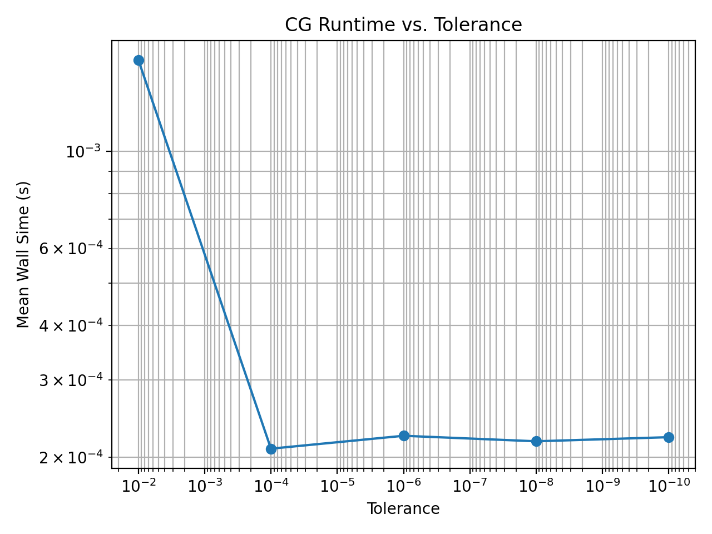
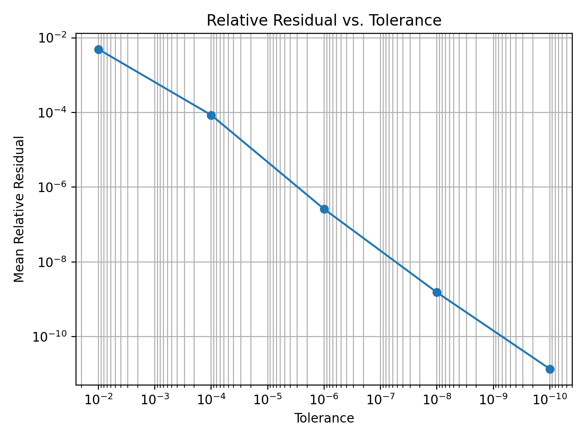

# Modeling and Optimizing a Sparse Conjugate Gradient Solver with Ginkgo

This repository contains a small case study on the performance of a sparse iterative solver (Conjugate Gradient, CG) using the Ginkgo library through its Python bindings `pyGinkgo`. The project follows Foothill's Applied Linear Algebra Lab modeling steps:

1. Find and understand a real world problem  
2. Mathematize the problem  
3. State an ideal mathematical model  
4. Use mathematics and computation to solve the ideal problem  
5. Analyze and assess the ideal model and solutions  
6. Think critically and verify the work  
7. Transfer the model to meaningful real world solutions  
8. Iterate, refine, and extend the model

The core code and data are as follows:

- `cg_solver.py` - runs CG on a real world sparse matrix, sweeps tolerances, and writes results to `results.csv`.
- `results.csv` - collected experimental data from multiple runs.
- `analysis.py` - summarizes runtime and residual statistics by tolerance.
- `plot_analysis.py` - generates plots `runtime_vs_tolerance.png` and `residual_vs_tolerance.png`.
- `bcsstk01.mtx` - SuiteSparse test matrix (structural stiffness matrix).

--

## STEP 1: Real-World Problem

Large scientific and engineering simulations (e.g., structural mechanics, fluid dynamics, electromagnetics) repeatedly need to solve sparse linear systems \(Ax = b\). These systems can have millions of unknowns and must be solved efficiently on modern hardware (multicore CPUs and GPUs).

Iterative Krylov methods like Conjugate Gradient (CG) are widely used for solving symmetric positive definite (SPD) systems because they:

- Require only matrix–vector products with the sparse matrix.
- Can exploit sparsity and parallelism.
- Are often used inside GPU‑accelerated libraries such as Ginkgo.

In the scope of this project, I focus on understanding and improving the performance behavior of CG on a real SPD matrix, using Ginkgo’s Python interface. The goal is to learn how solver parameters (especially the residual tolerance) affect runtime, convergence, and potential optimization strategies.

---

## STEP 2: Mathematize the problem

We model the core task as solving the linear system
\[
Ax = b,
\]
where

- \(A \in \mathbb{R}^{n \times n}\) is a sparse, symmetric positive definite stiffness matrix.
- \(b \in \mathbb{R}^n\) is the right‑hand side vector.
- \(x \in \mathbb{R}^n\) is the unknown solution.

### Concrete instance used here

- Matrix: `bcsstk01` from the SuiteSparse Collection, stored in `bcsstk01.mtx`.  
  - Size \(n = 48\).  
  - 224 stored entries (symmetric, so ~400 effective nonzeros).  
  - Origin: structural mechanics stiffness matrix.
- Right‑hand side: \(b = \mathbf{1}\), a vector of all ones.
- Initial guess: \(x_0 = 0\).

We measure convergence using the **residual vector**
\[
r = Ax - b
\]
and its Euclidean (2‑)norm
\[
\|r\|_2.
\]
We also use the **relative residual**
\[
\frac{\|r\|_2}{\|b\|_2},
\]
which makes it easier to compare different runs.

---

## STEP 3: Ideal mathematical model

### Solver model: Conjugate Gradient

For SPD matrices, CG iteratively improves the approximation \(x_k\) to \(x\) by:

- Computing a new search direction using residuals and previous directions.
- Taking a step along that direction that minimizes the energy norm error.

Each CG iteration involves:

- One or more sparse matrix–vector products (SpMV) with \(A\).
- Several vector operations (axpy‑type updates, dot products).

For a matrix with \(\text{nnz}(A)\) nonzeros, **one CG iteration** costs approximately
\[
O(\text{nnz}(A))
\]
operations, dominated by SpMV and vector updates.

If CG needs \(k(\varepsilon)\) iterations to reduce the residual norm below a tolerance \(\varepsilon\), then the **total cost** is
\[
O\big(\text{nnz}(A)\,k(\varepsilon)\big).
\]

### Convergence and stopping criteria

In `cg_solver.py`, I configure CG in Ginkgo with:

- Preconditioner: Jacobi.
- Stopping criteria:
  - Maximum 1000 iterations.
  - Residual norm reduction factor equal to a chosen tolerance \(\varepsilon\).

The theoretical expectation:

- Tighter tolerance (smaller \(\varepsilon\)) ⇒ more iterations \(k(\varepsilon)\) ⇒ higher runtime.
- Final relative residual should be on the order of, or below, \(\varepsilon\).

Because the Python bindings do not expose the iteration count, I treat **runtime** as a proxy for the number of iterations for this fixed matrix and hardware.

---

## STEP 4: Use mathematics and computation to solve the ideal problem

### Implementation: `cg_solver.py`

`cg_solver.py` performs the following steps for each run:

1. Load the sparse matrix:
   - Uses `pg.read(path="bcsstk01.mtx", dtype="double", format="Csr", device="cpu")` to load \(A\) as a CSR matrix on the CPU.
2. Build \(b\) and initial guess:
   - \(b\) is a dense tensor of ones.
   - \(x_0\) is a dense tensor of zeros.
3. Configure the solver:
   - CG with Jacobi preconditioner.
   - Stopping criteria: Iteration limit 1000, residual reduction factor = chosen tolerance.
4. Solve:
   - Calls `pg.config_solve(A, b, x, solver_args=solver_params)` to obtain a numerical solution \(x_\text{sol}\).
5. Measure performance and correctness:
   - Wall‑clock time using `time.perf_counter`.
   - Residual \(r = Ax_\text{sol} - b\) using `A.apply(x_sol, r)` and NumPy operations.
   - Residual norm \(\|r\|_2\) and relative residual \(\|r\|_2 / \|b\|_2\).
6. Append one line per run to `results.csv` with:
   - `run_id, tolerance, wall_time_s, residual_norm, relative_residual`.

### Experiment design

In `main()`:

- Tolerances tested:
  - \(10^{-2}, 10^{-4}, 10^{-6}, 10^{-8}, 10^{-10}\).
- Runs per tolerance:
  - 10 independent runs per tolerance (to average out timing noise).

Total: 50 CG solves, all recorded in `results.csv`.

---

## STEP 5: Analyze and assess the ideal model and solutions

### Numerical summary (`analysis.py`)

`analysis.py` loads `results.csv` and groups runs by tolerance to compute mean, standard deviation, minimum, and maximum of:

- `wall_time_s`
- `residual_norm`
- `relative_residual`

The summarized output is:

Summary by tolerance parameter:
             wall_time_s                               residual_norm                                  relative_residual                                 
                    mean       std       min       max          mean  std           min           max              mean  std           min           max
tolerance                                                                                                                                               
1.000000e-10    0.000222  0.000013  0.000215  0.000256  9.521926e-11  0.0  9.521926e-11  9.521926e-11      1.374372e-11  0.0  1.374372e-11  1.374372e-11
1.000000e-08    0.000217  0.000007  0.000211  0.000235  1.060580e-08  0.0  1.060580e-08  1.060580e-08      1.530815e-09  0.0  1.530815e-09  1.530815e-09
1.000000e-06    0.000224  0.000025  0.000196  0.000270  1.804234e-06  0.0  1.804234e-06  1.804234e-06      2.604188e-07  0.0  2.604188e-07  2.604188e-07
1.000000e-04    0.000209  0.000015  0.000197  0.000248  5.895431e-04  0.0  5.895431e-04  5.895431e-04      8.509322e-05  0.0  8.509322e-05  8.509322e-05
1.000000e-02    0.001619  0.004475  0.000190  0.014355  3.418069e-02  0.0  3.418069e-02  3.418069e-02      4.933558e-03  0.0  4.933558e-03  4.933558e-03

For easier reading, the key trends are:

| Tolerance | Mean wall time (s) | Mean relative residual |
|----------:|--------------------|------------------------|
| \(10^{-2}\)  | \(1.62\times 10^{-3}\) | \(4.93\times 10^{-3}\) |
| \(10^{-4}\)  | \(2.09\times 10^{-4}\) | \(8.51\times 10^{-5}\) |
| \(10^{-6}\)  | \(2.24\times 10^{-4}\) | \(2.60\times 10^{-7}\) |
| \(10^{-8}\)  | \(2.17\times 10^{-4}\) | \(1.53\times 10^{-9}\) |
| \(10^{-10}\) | \(2.22\times 10^{-4}\) | \(1.37\times 10^{-11}\) |

These results show:

- The **relative residual** decreases consistently as the requested tolerance is tightened, dropping from about \(5\times 10^{-3}\) at \(10^{-2}\) down to about \(10^{-11}\) at \(10^{-10}\), which confirms that the solver is achieving high accuracy when requested. 
- The **mean wall time** is smallest (aside from one outlier first run) around \(2\times 10^{-4}\) seconds for tolerances between \(10^{-4}\) and \(10^{-10}\). For this tiny matrix, fixed overhead dominates, so tighter tolerances do not dramatically increase runtime; on larger problems the dependence on tolerance would be stronger, as each additional iteration costs \(O(\text{nnz}(A))\). 

The two plots generated by `plot_analysis.py` visualize these trends:

- `runtime_vs_tolerance.png` – CG runtime vs. tolerance (log-log).

- `residual_vs_tolerance.png` – relative residual vs. tolerance (log-log).

These results show:

- The **relative residual** decreases almost linearly on the log–log plot as the tolerance is tightened. Each time the tolerance is reduced by two orders of magnitude (from \(10^{-2}\)→\(10^{-4}\)→\(10^{-6}\)→\(10^{-8}\)→\(10^{-10}\)), the mean relative residual also drops by roughly two orders of magnitude. This nearly straight line in the log–log plot indicates that the solver is tracking the requested tolerance very closely: asking for a stricter tolerance reliably yields a proportionally smaller residual.

- The **runtime vs. tolerance plot** shows one large drop going from \(10^{-2}\) to the smaller tolerances, and then a relatively flat curve from \(10^{-4}\) down to \(10^{-10}\). The first run at \(10^{-2}\) includes extra one‑time costs (Python start‑up, loading the matrix, JIT/optimizer warm‑up), so its wall time is much larger; once that overhead is amortized, all subsequent runs have similar wall times around \(2\times 10^{-4}\) seconds. This explains the big downward step at \(10^{-2}\) followed by a nearly horizontal line: for this tiny matrix, fixed overhead dominates, and the extra iterations needed for tighter tolerances do not significantly change the total runtime.

Because the matrix is very small (48×48), per‑run times are dominated by fixed overhead (Python, pyGinkgo bindings, and solver setup) rather than by the cost of additional CG iterations. As a result, runtime differences between \(10^{-4}\) and \(10^{-10}\) are modest, even though the relative residual improves by many orders of magnitude. On larger problems, where each iteration costs much more work, tightening the tolerance would cause a clearer increase in runtime.

These files are committed in the repo and can be embedded in this README.

---

## STEP 6: Think critically and verify the work

### Correctness checks

The near‑linear downward trend of the relative residual vs. tolerance on a log–log scale, together with the large one‑time runtime drop from \(10^{-2}\) to the tighter tolerances, is consistent with the expectation that: (1) CG can reliably meet the requested residual reduction, and (2) for this small matrix, runtime is dominated by fixed overhead rather than by the incremental cost of additional iterations.

Beyond these global trends, 3 specific checks support correctness:

1. **Residual norms vs. tolerance**

   For each tolerance, the mean relative residual is much smaller than 1 and matches the requested tolerance scale:

   - At \(10^{-2}\), mean relative residual \(\approx 4.93\times 10^{-3}\).
   - At \(10^{-6}\), mean relative residual \(\approx 2.60\times 10^{-7}\).
   - At \(10^{-10}\), mean relative residual \(\approx 1.37\times 10^{-11}\).

   This confirms that the numerical solutions \(x\) satisfy \(Ax \approx b\) to within the desired accuracy.

2. **Stability across runs**

   Within each tolerance, `results.csv` shows identical residuals and relative residuals across all 10 runs, and only small variation in wall time. This indicates deterministic solver behavior and that timing noise comes from the runtime environment, not from numerical instability.

3. **Sanity of solution values**

   Debug prints of the first few entries of \(x\) show finite, moderate‑sized floating‑point numbers (no NaNs or blow‑ups), which is consistent with solving a well‑posed SPD system.

### Limitations and critical reflection

- **Missing iteration counts**

  The pyGinkgo convergence logger type returned by `config_solve` does not expose iteration counts or residual histories to Python. Because of this, iteration counts could not be recorded directly, and wall‑clock runtime is used as a proxy for the effective number of iterations on this fixed matrix and hardware.

- **Single small matrix and backend**

  All experiments use a single, relatively small matrix (`bcsstk01`) and the reference CPU executor. The workflow generalizes, but the numerical results here should be viewed as a proof‑of‑concept (and not a large‑scale performance study).

- **Overhead vs. algorithmic cost**

  For \(n = 48\), Python and binding overheads are comparable to the work of a few CG iterations. On larger matrices, the theoretical cost model \(O(\text{nnz}(A)\,k(\varepsilon))\) would dominate behavior more clearly, and runtime would grow more noticeably as tolerance is tightened.

---

## STEP 7: Transfer the model to meaningful real‑world solutions

Even though the test case is small, the modeling workflow and conclusions shown above can extend to real scientific/engineering applications that involve repeatedly  solving large sparse SPD systems.

Below, I will summarize how specfic findings support such real world applications.

1. **Choosing tolerances in practice**

   The experiments show that tightening the tolerance from \(10^{-2}\) to \(10^{-10}\) yields residuals that decrease by roughly the same factor. In real simulations, this informs how to pick a tolerance that is “good enough” for the downstream quantity of interest (e.g., stress, displacement, pressure) without overspending runtime.

2. **Preconditioner strategies**

   This project uses Jacobi as a very simple preconditioner. For modest problems it works fine, but on larger or poorly conditioned systems, Jacobi may require many iterations. The same logging setup (tolerance sweep → `results.csv` → analysis) can be reused to compare Jacobi with stronger preconditioners such as ILU or incomplete Cholesky, allowing one to:

   - Quantify how many fewer iterations (or how much less time) a stronger preconditioner needs.
   - Balance that against extra setup cost and memory usage.

3. **Executor and hardware choices**

   Ginkgo separates the linear operator from the execution backend. The same CG configuration used here on the reference CPU executor can, in principle, be run on OpenMP, CUDA, HIP, or SYCL executors. The analysis pipeline in this repo can therefore be reused to:

   - Compare CPU vs. GPU performance for larger matrices.
   - Study how runtime and effective per‑iteration cost change as one moves to more parallel hardware where memory bandwidth is the main bottleneck.

---

## STEP 8: Iterate, refine, and extend the model

The project completely and successfully models ?

Future iterations will include:

- **Larger and multiple matrices**

  Run the same CG + logging framework on larger SPD matrices from the SuiteSparse Collection or application codes. This would reveal how runtime scales with \(n\) and \(\text{nnz}(A)\), and let you empirically fit a cost model of the form
  \[
  T(\varepsilon) \approx C \cdot \text{nnz}(A)\,k(\varepsilon).
  \]

- **Expose and use iteration counts**

  Extend or wrap pyGinkgo to expose CG iteration counts and residual histories from Ginkgo’s convergence logger. With that, you could plot iterations vs. tolerance directly and compare convergence rates to theoretical expectations based on the condition number \(\kappa(A)\).

- **Compare different preconditioners**

  Add experiments that swap Jacobi for stronger preconditioners, then log and compare runtime and residual norms. This would make the preconditioner–performance trade‑off concrete: fewer iterations but higher per‑iteration cost and more memory.

- **Mixed‑precision strategies**

  Investigate mixed‑precision approaches where SpMV operations run in single precision while key reductions or corrections remain in double precision. This can reduce memory traffic and improve throughput on bandwidth‑limited architectures.

- **Parallel and GPU backends**

  On appropriate hardware, rerun the experiments using OpenMP or GPU executors in Ginkgo. This would allow direct measurement of strong/weak scaling and the impact of memory bandwidth on iterative solver performance.

All of these future iterations would tighten the connection between the mathematical model (CG complexity and convergence), computational implementation (pyGinkgo + backends), and real‑world performance optimization of sparse linear solvers.
