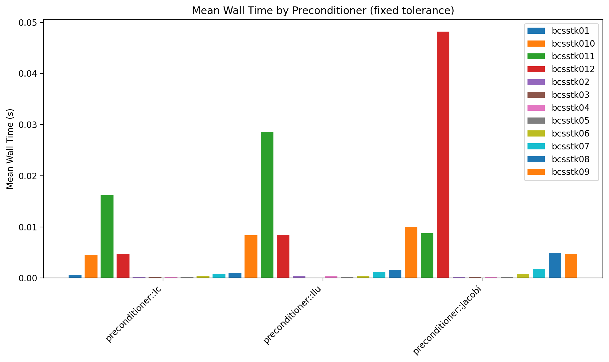
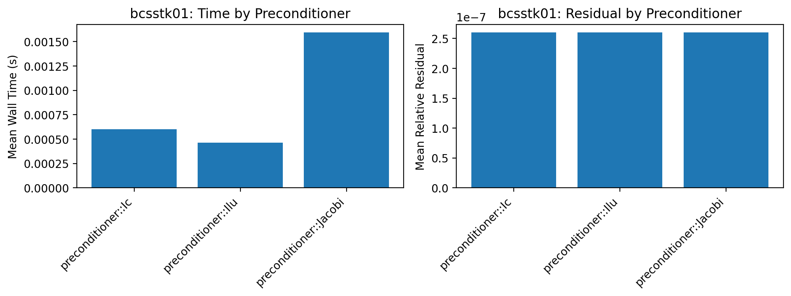
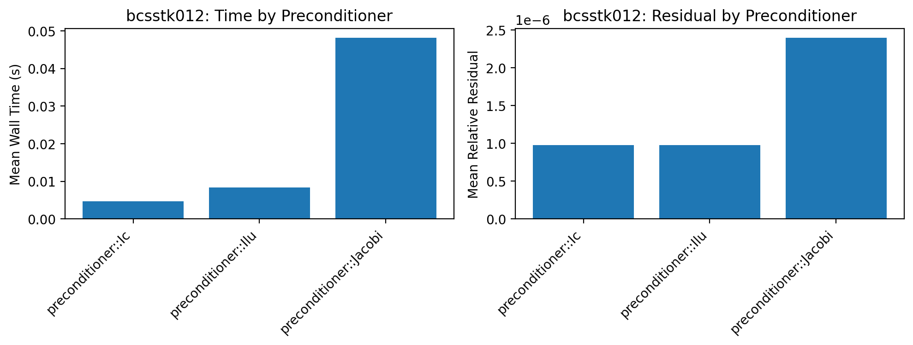

# Modeling and Optimizing a Sparse Conjugate Gradient Solver with Ginkgo

This repository studies how to model and optimize a sparse Conjugate Gradient (CG) solver implemented with the Ginkgo library through its Python bindings `pyGinkgo`. The project follows Foothill’s Applied Linear Algebra Lab workflow: start from a real sparse SPD problem, build a mathematical and computational model, design experiments, and interpret results in terms of solver parameters, preconditioners, and matrix size.  

The core goal is to understand how tolerance, matrix dimension, and preconditioning (Jacobi, IC, ILU) interact to determine runtime and accuracy for structural stiffness matrices drawn from the SuiteSparse `bcsstk` family.

## Repository layout

- `src/`
  - `cg_solver.py` – runs CG on each matrix in `matrices/` at a fixed tolerance, sweeps over three preconditioners (Jacobi, IC, ILU), and writes per‑run statistics to CSV.
  - `analysis.py` – aggregates results by matrix and preconditioner and prints tables of mean, standard deviation, min, and max for wall time and residual metrics.
  - `plot_analysis.py` – generates comparison plots of mean wall time and mean relative residual across matrices and preconditioners.
- `matrices/` – SuiteSparse `bcsstk` stiffness matrices of increasing size and sparsity, from \(48\times 48\) up to \(11948\times 11948\). [web:1][web:6]
- `results/` – CSV files (`results01.csv`, …, `results18.csv`) with raw experimental data.
- `plots/`
  - `cg_analysis_all_matrices.png` – global tolerance and size analysis across all downloaded matrices.
  - `preconditioners_time_comparison.png` – mean wall time by preconditioner and matrix (matrices indexed 1–12; indices skip missing `bcsstk` IDs).
  - `prec_bcsstk0x.png` – per‑matrix bar charts of mean wall time and mean relative residual by preconditioner.
  - `analysis_plots_by_tol/` – older tolerance‑sweep plots for `bcsstk01` used to choose a “good” fixed tolerance for the newer multi‑matrix experiments.

  All matrices come from the SuiteSparse Matrix Collection (Harwell–Boeing `bcsstk` structural stiffness problems), and are symmetric positive definite, which makes them suitable for CG.

## Real-world problem and model

Large simulations in structural mechanics, fluids, and related fields repeatedly solve sparse SPD systems
\[
Ax = b,
\]
where \(A\) is a stiffness matrix arising from discretized PDEs, \(b\) is a load or forcing vector, and \(x\) contains displacements or other state variables. Direct factorization can become too slow or memory‑intensive for very large problems, so iterative Krylov methods such as CG are preferred. Each CG iteration costs \(O(\mathrm{nnz}(A))\) operations, dominated by sparse matrix–vector products plus a few vector updates and dot products.

Preconditioners change the effective conditioning of the system and therefore the number of iterations \(k(\varepsilon)\) that CG needs to reach a relative residual tolerance \(\varepsilon\). Simple diagonal (Jacobi) preconditioning is cheap to set up but may converge slowly, whereas incomplete Cholesky (IC) and incomplete LU (ILU) have higher setup and per‑iteration costs but can dramatically reduce \(k(\varepsilon)\) on tougher matrices.

Although the experiments here use SuiteSparse `bcsstk` matrices, the workflow is designed to generalize to real applications. Anyone solving sparse SPD systems from finite‑element structural models, fluid flow simulations, power‑grid networks, or similar PDE‑based problems can plug their own matrices into this pipeline, sweep tolerances and preconditioners, and use the resulting plots to pick a solver configuration that meets their accuracy target at minimum runtime.
In that sense, the project is a reuseable template for making informed solver and preconditioner choices in production simulation codes that rely on Ginkgo and pyGinkgo.

## Implementation and experiments

For each matrix in `MATRIX_FILES`, `cg_solver.py`:

1. Loads \(A\) as a CSR matrix on the CPU via `pg.read`.
2. Builds \(b\) as a vector of ones and \(x_0\) as zeros.
3. Configures a CG solver with a chosen preconditioner and stopping criteria:
   - maximum 1000 iterations;
   - residual norm reduction factor (relative residual) fixed at \(\varepsilon = 10^{-6}\).
4. Calls `pg.config_solve(A, b, x, solver_args=...)` and measures wall time with `time.perf_counter`.
5. Computes the residual \(r = Ax - b\), its Euclidean norm, and the relative residual \(\|r\|_2 / \|b\|_2\).
6. Appends one line to the appropriate CSV file with:
   - `run_id, preconditioner, tolerance, wall_time_s, residual_norm, relative_residual`.

Each matrix–preconditioner pair is run 10 times to average out timing noise from Python and the operating system, while the linear algebra itself remains deterministic.

`analysis.py` groups each CSV by preconditioner to summarize mean, standard deviation, minimum, and maximum of `wall_time_s`, `residual_norm`, and `relative_residual`. A final combined table aggregates mean wall time by matrix and preconditioner, which is then visualized by `plot_analysis.py` as bar charts. 

## Results and analysis

### Tolerance and size trends

The figure below summarizes the original tolerance sweep (top row) and size scaling (bottom row) across all matrices using Jacobi preconditioning:


- The **CG Runtime vs. Tolerance** panel shows that for each matrix, runtime drops sharply from the loosest tolerance (\(10^{-2}\)) to tighter values and then flattens out, indicating that one‑time setup overheads and Python/pyGinkgo costs dominate for small to medium matrices. [image:1]
- The **Relative Residual vs. Tolerance** panel is nearly a straight line on a log–log scale, confirming that tightening the requested tolerance reliably yields proportionally smaller final residuals across all matrices.

The **Runtime Scaling with Matrix Size** and **Fixed Tolerance Performance** panels at the bottom of the same figure both plot mean wall time (using the tightest or fixed tolerance) against an index that orders the `bcsstk` matrices by dimension. These plots show that:
- Runtime grows with matrix size, but not perfectly monotonically; one matrix in the mid‑range (around index 4) is noticeably more expensive, reflecting differences in nonzeros and conditioning as well as size.
- For small matrices, overheads hide most tolerance effects, while for the largest ones, the cost of additional CG iterations becomes clearly visible in the wall time.

### Preconditioner comparison

The next plot compares mean wall time by preconditioner at the fixed tolerance \(\varepsilon = 10^{-6}\) across all matrices. Here, matrix indices 1–12 are used to keep the x‑axis compact; they correspond to the subset of `bcsstk` matrices that were actually downloaded (skipping 7, 9, 10, 12, 13, and 17).



- For **small matrices**, the three preconditioners have similar runtimes because setup and Python overhead dominate; differences in iteration counts barely affect the overall time.
- For **larger matrices**, IC typically yields the lowest mean wall time among the three, with ILU slightly slower and Jacobi often much slower, reflecting the trade‑off between stronger preconditioning (fewer iterations) and the extra work to build and apply the preconditioner.

### Prec-matrix behavior and the size “threshold”

To zoom in, the prec‑matrix plots illustrate how each preconditioner behaves for a specific matrix. For example, the first matrix (`bcsstk01`) shows:



- **Mean relative residuals** for Jacobi, IC, and ILU are visually indistinguishable and all safely below the target tolerance, which means all three preconditioners are effectively “good enough” in terms of accuracy on this tiny \(48\times 48\) problem. 
- **Mean wall times** differ slightly, with ILU appearing marginally faster than IC and Jacobi slower, but the absolute times are so small that these differences mainly reflect noise and fixed overhead rather than meaningful algorithmic gaps.

The interesting behavior appears for the largest matrix in the set (`bcsstk18.mtx`, labeled `bcsstk012` in the plots because of the skipped indices):



- Here, **Jacobi’s mean relative residual is clearly higher** than the residuals for IC and ILU, which remain tightly clustered at a smaller value; this is the first and only matrix where the plot shows a visible separation in residual quality between Jacobi and the stronger preconditioners at the same requested tolerance.
- At the same time, **Jacobi’s mean wall time is significantly larger** than both IC and ILU, while IC is slightly faster than ILU. This indicates that, beyond some matrix size and difficulty (between roughly \(4884\times 4884\) for `bcsstk16` and \(11948\times 11948\) for `bcsstk18`), Jacobi not only converges to a worse residual but also needs substantially more iterations, making it a poor choice compared to IC or ILU.

Taken together, the family of `prec_bcsstk0x.png` plots shows that:

- For all matrices except the largest one, **all three preconditioners deliver essentially identical mean relative residuals**, so the main difference is runtime. This suggests that on small and moderate stiffness problems, any of the three is numerically adequate, and the choice can be guided by implementation convenience. 
- For the largest matrix (`bcsstk18`), **IC emerges as the best compromise**, achieving both the lowest mean wall time and one of the lowest residuals, while **Jacobi becomes clearly suboptimal** in both speed and accuracy. This provides empirical evidence for a *size and conditioning threshold* beyond which simple diagonal preconditioning is no longer effective for SPD stiffness matrices and more sophisticated preconditioners are needed.

## How to reproduce

This project uses

- Ginkgo (C++ library): https://github.com/ginkgo-project/ginkgo 
- pyGinkgo (Python bindings): https://github.com/Helmholtz-AI-Energy/pyGinkgo 

The steps below summarize what worked on an Apple Silicon (M3) macOS system using the **reference** executor only (no CUDA/HIP/OpenMP) and Python 3.

1. **Install Ginkgo (reference backend only)**

```
git clone https://github.com/ginkgo-project/ginkgo.git
cd ginkgo
mkdir build && cd build

cmake ..
-DGINKGO_BUILD_REFERENCE=ON
-DGINKGO_BUILD_OMP=OFF
-DGINKGO_BUILD_CUDA=OFF
-DGINKGO_BUILD_HIP=OFF
-DGINKGO_BUILD_DPCPP=OFF
-DGINKGO_BUILD_TESTS=OFF
-DGINKGO_BUILD_EXAMPLES=OFF
-DGINKGO_BUILD_BENCHMARKS=OFF
-DCMAKE_INSTALL_PREFIX=/opt/homebrew
```

cmake --build . -j$(sysctl -n hw.ncpu)
sudo cmake --install .
This installs the reference executor into `/opt/homebrew/lib` (no GPU or OpenMP backends, which are problematic on recent Apple Silicon systems).

2. **Install pyGinkgo (with the `Ginkgo::ginkgo` target fix)**

git clone https://github.com/Helmholtz-AI-Energy/pyGinkgo.git
cd pyGinkgo
mkdir build && cd build

Early versions of pyGinkgo assume a CMake target called `ginkgo`, but modern Ginkgo exports `Ginkgo::ginkgo` instead.
If CMake fails with an error like

> `install IMPORTED_RUNTIME_ARTIFACTS given target "ginkgo" which does not exist`

then:

- Open `CMakeLists.txt` in the pyGinkgo repo.
- Replace every occurrence of the bare target name `ginkgo` with `Ginkgo::ginkgo`.
- Save and reconfigure:

  ```
  cmake .. -DGinkgo_DIR=/opt/homebrew/lib/cmake/Ginkgo
  cmake --build . -j$(sysctl -n hw.ncpu)
  sudo cmake --install .
  ```

Point `Ginkgo_DIR` to wherever `GinkgoConfig.cmake` was installed on your system (for Homebrew‑style prefix this is typically `/opt/homebrew/lib/cmake/Ginkgo`). 

3. **Set up Python environment**

python -m venv .venv
source .venv/bin/activate
pip install numpy pandas matplotlib

4. **Run this project**

Run in this order: `cg_solver.py` -> `analysis.py` -> `plot_analysis.py`


